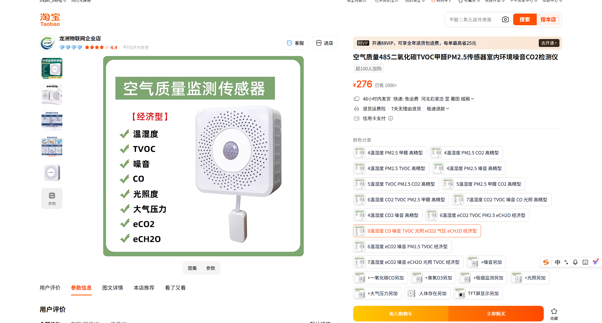
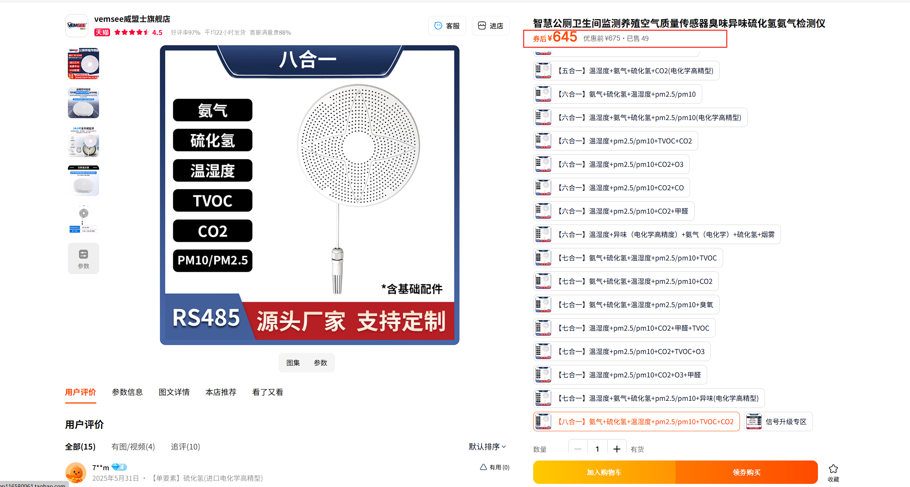
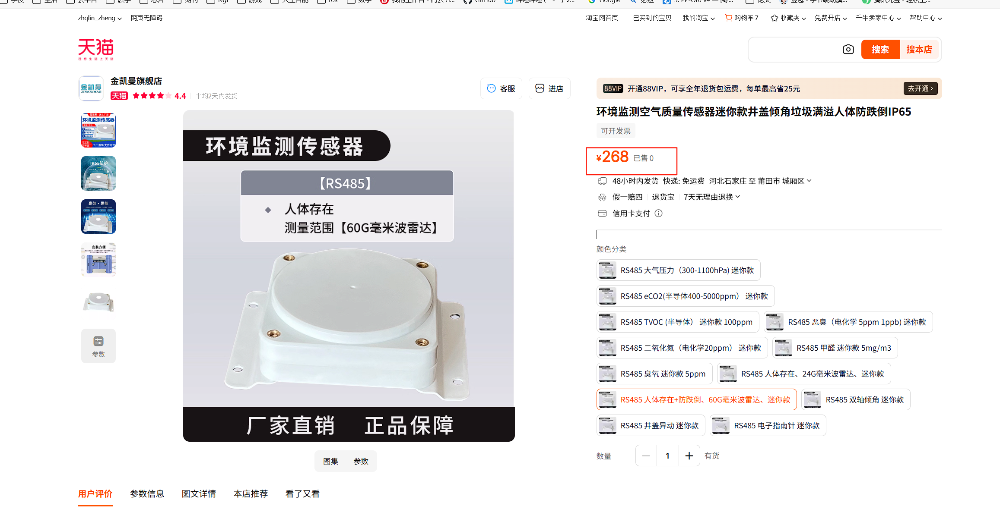
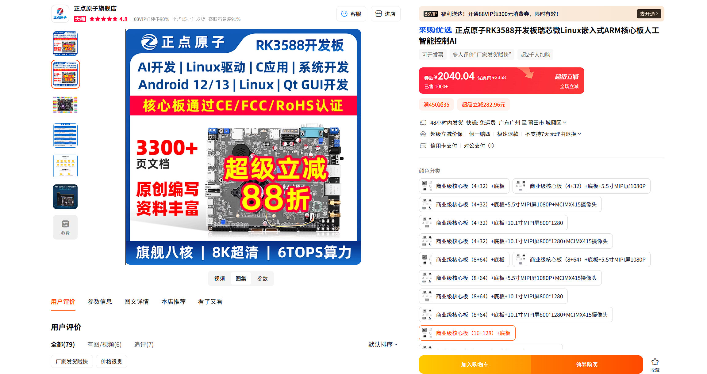
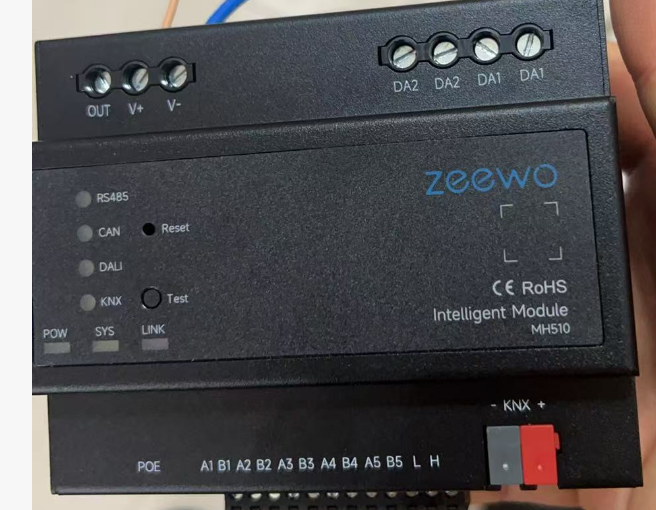
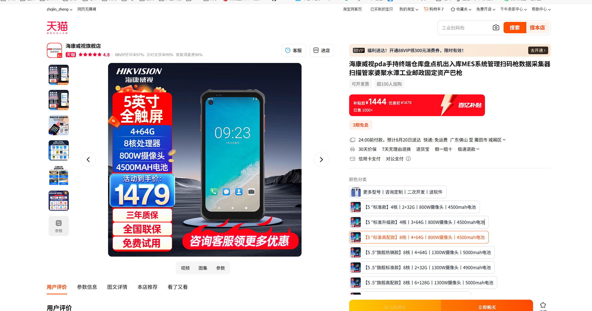
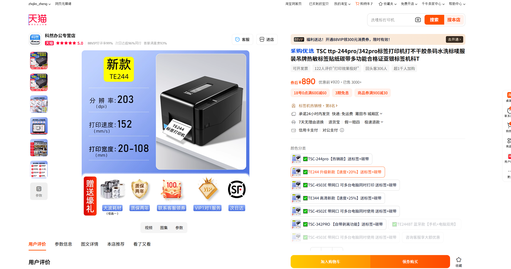

# 技术验收指标

## 一、技术指标

## 二、传感器

### 1. 多合一传感器 1
  

[购买链接](https://item.taobao.com/item.htm?ali_refid=a3_420434_1006%3A1295640157%3AN%3ASI90P7Per0XeJhW5pyY7XG%2BFztb96tqA%3Aac0af812f87a9583088885900255b539&ali_trackid=1_ac0af812f87a9583088885900255b539&id=618672897346&mi_id=0000yZK33vJhHO0HsUOMi8EngFLTxvCUhbfakjGRj4bi9Dc&mm_sceneid=1_0_1097400009_0&priceTId=2150466117554417450965320e138f&skuId=4370418765053&spm=a21n57.1.hoverItem.1&utparam=%7B%22aplus_abtest%22%3A%220bc511e2e7be0e90fabd4151d5474ace%22%7D&xxc=ad_ztc)

**价格 279.**

- 感觉有点便宜，不知道性能如何，**得测试**

### 2. 多合一传感器 2

[购买链接](https://detail.tmall.com/item.htm?abbucket=14&id=677998869360&mi_id=0000rAdVJshpSFBR8ElT195yOHcPMjILYbZUUeHmKYeXLlE&ns=1&priceTId=2147847a17554425435858096e12ce&spm=a21n57.1.hoverItem.6&utparam=%7B%22aplus_abtest%22%3A%22a454a8430b35f0a6d17ec55d14e60961%22%7D&xxc=taobaoSearch&skuId=5468838324002)

价格 645

### 3. 人体存在

[购买链接](https://detail.tmall.com/item.htm?abbucket=14&id=723642044298&mi_id=0000TcJBYlzzu2XJotK6Wyjb0gdkK_pCwN8fyJR-nnfRWsg&ns=1&priceTId=2150466117554415659778100e138f&skuId=5685097691412&spm=a21n57.1.hoverItem.48&utparam=%7B%22aplus_abtest%22%3A%22523a9453f3547e62aa079d1537b145f7%22%7D&xxc=taobaoSearch)

- 价格 **268**

### 4. 烟雾报警

[购买链接](https://detail.tmall.com/item.htm?abbucket=14&id=728620899733&mi_id=0000DjYziX_hVg9m0K3uazWJv_yniNFTj-u6T4jXp5TiHGQ&ns=1&priceTId=213e049b17554435178153768e11b6&skuId=5048690040967&spm=a21n57.1.hoverItem.2&utparam=%7B%22aplus_abtest%22%3A%22a1ac45136bda661cdd4268efc2aea371%22%7D&xxc=taobaoSearch)

价格 **155**

## 三、摄像头

## 四、主控制器

[购买链接](https://detail.tmall.com/item.htm?abbucket=14&id=806049145362&mi_id=0000YgAp06UgHJfzsjMQETf4-SPH8vPqyX0iTTfJdia3EtI&ns=1&priceTId=213e001d17554450684908358e148b&skuId=5651409539572&spm=a21n57.1.hoverItem.2&utparam=%7B%22aplus_abtest%22%3A%220853a1da6006ccedd8005d8b94f95c4c%22%7D&xxc=taobaoSearch)

## 五、485网关

## 六、无线AP

  支持mesh组网

## 七、二维码扫描

  支持二次开发

[购买链接](https://detail.tmall.com/item.htm?abbucket=14&fpChannel=101&fpChannelSig=a97975f6b3d645a20e010db45702b0f4d7501470&id=924198368175&mi_id=00009kQuFRBQGz9Bcie7gysiBoYqQJGj4ziydkOn-yuCUI0&ns=1&priceTId=213e001d17554449548922645e148b&skuId=6072088346584&spm=a21n57.1.hoverItem.4&u_channel=bybtqdyh&umpChannel=bybtqdyh&utparam=%7B%22aplus_abtest%22%3A%222b1b0828dff906a40c1a92c19874874d%22%7D&xxc=taobaoSearch)

## 八、二维码生成器

[购买链接](https://detail.tmall.com/item.htm?abbucket=14&id=42198607857&mi_id=0000qAqdYjN6TocrIqntFbhTP4k3KfRnOJKHCBHVme7YoSE&ns=1&priceTId=2147850717554454016291085e1257&skuId=5705656853220&spm=a21n57.1.hoverItem.2&utparam=%7B%22aplus_abtest%22%3A%22a4829bf6106da22d9433c40533f9d5dc%22%7D&xxc=taobaoSearch)
